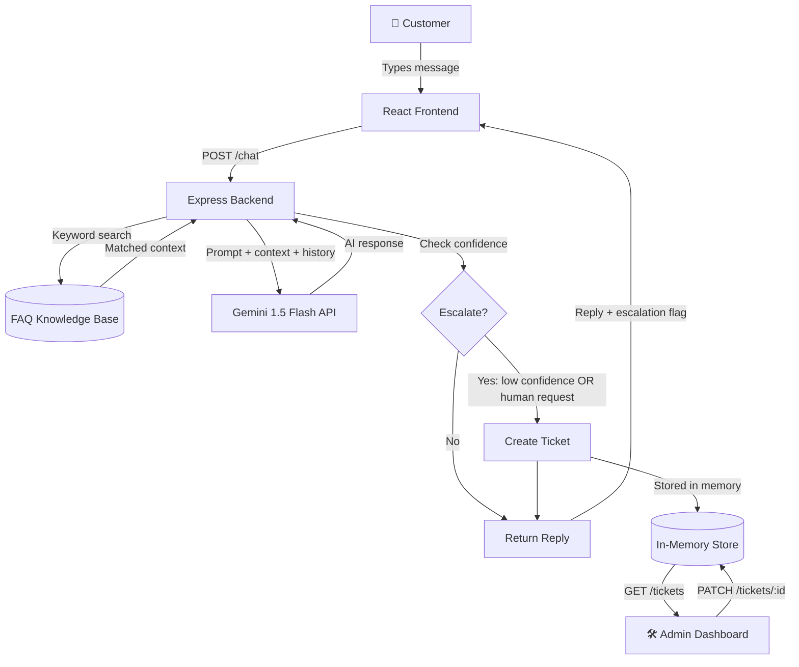

# 💬 AI SupportFlow

> **AI-powered customer support assistant with escalation workflow, FAQ retrieval, and an admin dashboard.**

Built with React + Vite, Node.js + Express, and Google Gemini — designed as a polished hackathon/internship-ready MVP.

---

## ✨ Features

| Feature | Description |
|---|---|
| 💬 **Chat Interface** | WhatsApp-inspired UI with message bubbles, quick replies, and auto-scroll |
| 🤖 **AI Responses** | Gemini 1.5 Flash generates context-aware customer support replies |
| 📚 **FAQ Retrieval** | Keyword-based knowledge base enriches AI with relevant policy context |
| 🎫 **Escalation System** | Auto-escalates low-confidence answers + manual "Talk to Human" button |
| 📋 **Admin Dashboard** | Real-time ticket table with resolve functionality and stats |
| 🕓 **Conversation Memory** | Multi-turn conversation history sent to Gemini for context |

---

## 🏗️ Architecture



---

## 📁 Folder Structure

```
ai-supportflow/
├── backend/
│   ├── data/
│   │   ├── faqs.js          # Knowledge base with 7 FAQ entries
│   │   └── store.js         # In-memory conversation + ticket storage
│   ├── routes/
│   │   ├── chat.js          # POST /chat endpoint
│   │   ├── tickets.js       # GET/POST/PATCH ticket endpoints
│   │   ├── geminiService.js # Gemini API integration
│   │   └── faqMatcher.js    # Keyword matching + escalation logic
│   ├── server.js            # Express app entry point
│   ├── package.json
│   └── .env.example
│
└── frontend/
    ├── src/
    │   ├── components/
    │   │   ├── Navbar.jsx         # Top navigation
    │   │   ├── MessageBubble.jsx  # User + bot chat bubbles
    │   │   ├── TypingIndicator.jsx # Animated typing dots
    │   │   └── TicketRow.jsx      # Admin table row
    │   ├── pages/
    │   │   ├── ChatPage.jsx       # Customer chat interface
    │   │   └── AdminPage.jsx      # Admin ticket dashboard
    │   ├── utils/
    │   │   └── api.js             # Axios API client
    │   ├── App.jsx
    │   ├── main.jsx
    │   └── index.css
    ├── index.html
    ├── vite.config.js
    ├── tailwind.config.js
    ├── package.json
    └── .env.example
```

---

## 🚀 Setup Instructions

### Prerequisites
- Node.js ≥ 18
- A [Google Gemini API key](https://aistudio.google.com/app/apikey) (free tier available)

### 1. Clone & install

```bash
git clone <repo-url>
cd ai-supportflow
```

### 2. Backend setup

```bash
cd backend
npm install
cp .env.example .env
# Edit .env and add your GEMINI_API_KEY
npm run dev
# → Running on http://localhost:5000
```

### 3. Frontend setup

```bash
cd ../frontend
npm install
cp .env.example .env
npm run dev
# → Running on http://localhost:5173
```

### 4. Open in browser

- **Chat**: http://localhost:5173
- **Admin**: http://localhost:5173/admin

---

## ⚙️ Environment Variables

### Backend (`backend/.env`)

```env
GEMINI_API_KEY=your_gemini_api_key_here
PORT=5000
FRONTEND_URL=http://localhost:5173
```

### Frontend (`frontend/.env`)

```env
VITE_API_URL=http://localhost:5000
```

---

## 📡 API Reference

### `POST /chat`
Send a message and receive an AI reply.

**Request:**
```json
{
  "message": "What is your refund policy?",
  "conversationId": "conv_1"  // optional, omit for new conversation
}
```

**Response:**
```json
{
  "reply": "We offer a 30-day full refund policy on all purchases...",
  "conversationId": "conv_1",
  "escalated": false,
  "ticket": null,
  "faqMatched": true
}
```

**Escalated response:**
```json
{
  "reply": "I've escalated your request... Your ticket ID is **TKT-0001**.",
  "conversationId": "conv_1",
  "escalated": true,
  "ticket": {
    "id": "TKT-0001",
    "conversationId": "conv_1",
    "userQuery": "I want to talk to a human",
    "status": "open",
    "timestamp": "2024-01-15T10:30:00.000Z",
    "resolvedAt": null
  }
}
```

---

### `GET /tickets`
Get all escalation tickets.

**Response:**
```json
{
  "tickets": [
    {
      "id": "TKT-0001",
      "conversationId": "conv_1",
      "userQuery": "I want a refund for my order",
      "status": "open",
      "timestamp": "2024-01-15T10:30:00.000Z",
      "resolvedAt": null
    }
  ],
  "total": 1
}
```

---

### `PATCH /tickets/:id`
Resolve a ticket.

**Response:**
```json
{
  "ticket": {
    "id": "TKT-0001",
    "status": "resolved",
    "resolvedAt": "2024-01-15T11:00:00.000Z"
  }
}
```

---

### `POST /tickets/escalate`
Manually escalate a conversation.

**Request:**
```json
{
  "conversationId": "conv_1",
  "userQuery": "Complex technical issue with API integration"
}
```

---

## 🧠 Escalation Logic

Escalation is triggered by any of these conditions:

1. **User intent keywords** — message contains: `"human"`, `"agent"`, `"real person"`, `"talk to someone"`, `"escalate"`
2. **Low confidence AI signals** — response contains: `"I'm not sure"`, `"I cannot"`, `"I'm unable"`, `"please contact"`, etc.
3. **Manual button** — user clicks the 👤 "Talk to Human" button in the chat UI

---

## 🎨 UI Design Decisions

- **WhatsApp-inspired** — green palette, dark header, bubble layout with tails, double-tick read receipts
- **Pattern background** — subtle dot pattern on chat area (authentic WhatsApp feel)
- **DM Sans font** — modern, friendly, highly readable
- **Animated typing indicator** — three bouncing dots signal AI is thinking
- **Quick replies** — pre-set questions reduce friction for first-time users
- **Auto-scroll** — new messages always visible without manual scrolling

---

## 🗺️ Demo Presentation Points

- **Problem**: Customer support is slow, expensive, and inconsistent
- **Solution**: AI-first support that resolves common queries instantly
- **Flow**: User asks → FAQ context retrieved → Gemini responds → escalate if needed
- **Demo**: Show refund query, then trigger human escalation, check admin dashboard
- **Scalability**: FAQ system is plug-and-play; swap JSON for a vector DB for semantic search
- **Business value**: Reduces support ticket volume by ~60–70% for common queries

---

## 🔮 Future Improvements

### Short-term (1–2 weeks)
- [ ] **SQLite / Supabase** — persist conversations and tickets across restarts
- [ ] **Semantic FAQ search** — replace keyword matching with embeddings (e.g. OpenAI `text-embedding-3-small`)
- [ ] **Streaming responses** — stream Gemini output token-by-token for faster perceived response
- [ ] **Toast notifications** — escalation and resolve confirmations in admin

### Medium-term (1 month)
- [ ] **Auth** — simple JWT-based admin login to protect the dashboard
- [ ] **CSAT feedback** — thumbs up/down after each bot reply to track satisfaction
- [ ] **Analytics page** — charts for ticket volume, resolution rate, common topics
- [ ] **Export tickets** — CSV download from admin dashboard

### Long-term
- [ ] **Multi-tenant** — support multiple business clients with separate knowledge bases
- [ ] **Real WhatsApp integration** — via Twilio or Meta Cloud API
- [ ] **LLM fine-tuning** — fine-tune on resolved ticket history for domain-specific accuracy
- [ ] **Voice support** — speech-to-text input using Web Speech API

---

## 🛠️ Tech Stack

| Layer | Technology | Why |
|---|---|---|
| Frontend | React 18 + Vite | Fast HMR, modern React features |
| Styling | TailwindCSS | Utility-first, rapid UI development |
| HTTP client | Axios | Clean API calls with interceptors |
| Routing | React Router v6 | SPA navigation |
| Backend | Node.js + Express | Lightweight, fast to build |
| AI | Google Gemini 1.5 Flash | Free tier, fast, capable |
| Storage | In-memory (JS objects) | Zero setup for MVP; swap-ready |

---

*Built with ❤️ as an internship project demo. Designed to be simple, readable, and extensible.*
